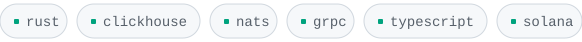
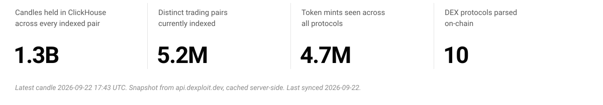

<picture>
  <source media="(prefers-color-scheme: dark)" srcset="assets/header-dark.svg">
  
</picture>

<picture>
  <source media="(prefers-color-scheme: dark)" srcset="assets/stack-dark.svg">
  
</picture>

## Dexploit

> **Skip the data pipeline. Ship your Solana app.**

Pre-parsed OHLCV candles, swap events, and price streams across Solana DEXs — over REST, WebSocket, gRPC, and GraphQL, with a free tier instead of an enterprise contract.

[**dexploit.dev**](https://dexploit.dev) &nbsp;·&nbsp; [docs](https://docs.dexploit.dev) &nbsp;·&nbsp; [npm](https://www.npmjs.com/package/@dexploit/mcp) &nbsp;·&nbsp; [github.com/DexploitV1](https://github.com/DexploitV1)

<!-- STATS:START -->
<picture>
  <source media="(prefers-color-scheme: dark)" srcset="assets/stats-dark.svg">
  
</picture>
<!-- STATS:END -->

Rust services parse swaps out of on-chain program data, normalize them through a shared pipeline, and aggregate candles into ClickHouse. NATS moves events between the protocol workers and the gateway. REST terminates behind Cloudflare; WebSocket and gRPC run direct to the edge, keeping proxy buffering out of the streaming path.

> [!NOTE]
> **[Dexploit-MCP](https://github.com/DexploitV1/Dexploit-MCP)** wires the API into Claude Code, Claude Desktop, and Cursor, so a model queries real Solana data instead of inventing it.
> ```
> npx -y @dexploit/mcp
> ```

## Also building

**[PoGoBot](https://github.com/1tzkaos/PoGoBot)** &nbsp;`python` &nbsp;`computer-vision`<br>
Screen-reading game automation in three separately testable layers — perception, decision, actuation. The state machine refuses to start if any state is missing a handler or a timeout.

**solbot** &nbsp;`private` &nbsp;`typescript`<br>
A paper-trading simulator running several strategy configurations in parallel lanes off one shared market feed, so parameter sets are compared against identical ticks. Built against the Dexploit API.

## Recently

<!-- ACTIVITY:START -->
- opened a PR in [`1tzkaos/docs`](https://github.com/1tzkaos/docs)
- opened a PR in [`DexploitV1/Dexploit-MCP`](https://github.com/DexploitV1/Dexploit-MCP)

<sub>updated 2026-08-18</sub>
<!-- ACTIVITY:END -->

---

<sub>[LinkedIn](https://www.linkedin.com/in/nbstanki/) &nbsp;·&nbsp; [nbstanki@mtu.edu](mailto:nbstanki@mtu.edu)</sub>
