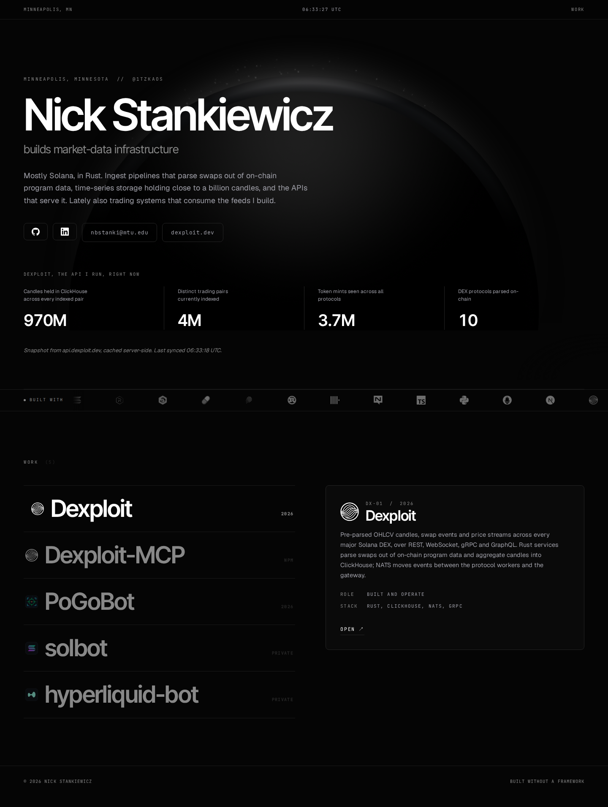

<picture>
  <source media="(prefers-color-scheme: dark)" srcset="assets/header-dark.svg">
  
</picture>

Mostly Solana, in Rust. Ingest pipelines that parse swaps out of on-chain program data, time-series storage holding close to a billion candles, and the APIs that serve it. Lately also trading systems that consume the feeds I build.

<a href="https://1tzkaos.github.io/"><b>1tzkaos.github.io</b></a>
&nbsp;·&nbsp; <a href="https://dexploit.dev">dexploit.dev</a>
&nbsp;·&nbsp; <a href="https://www.linkedin.com/in/nbstanki/">LinkedIn</a>
&nbsp;·&nbsp; <a href="mailto:nbstanki@mtu.edu">nbstanki@mtu.edu</a>

<picture>
  <source media="(prefers-color-scheme: dark)" srcset="assets/stack-dark.png">
  
</picture>

## Dexploit

> **Skip the data pipeline. Ship your Solana app.**

Pre-parsed OHLCV candles, swap events and price streams across every major Solana DEX, over REST, WebSocket, gRPC and GraphQL. Rust services parse swaps out of on-chain program data and aggregate candles into ClickHouse; NATS moves events between the protocol workers and the gateway.

[**dexploit.dev**](https://dexploit.dev) &nbsp;·&nbsp; [docs](https://docs.dexploit.dev) &nbsp;·&nbsp; [npm](https://www.npmjs.com/package/@dexploit/mcp) &nbsp;·&nbsp; [DexploitV1](https://github.com/DexploitV1)

<!-- STATS:START -->
<picture>
  <source media="(prefers-color-scheme: dark)" srcset="assets/stats-dark.svg">
  
</picture>
<!-- STATS:END -->

> [!NOTE]
> **[Dexploit-MCP](https://github.com/DexploitV1/Dexploit-MCP)** wires the API into Claude Code, Claude Desktop and Cursor, so a model queries real Solana data instead of inventing it.
> ```
> npx -y @dexploit/mcp
> ```

## Work

| | Project | Stack | What it is |
|---|---|---|---|
| `DX-01` | **[Dexploit](https://dexploit.dev)** | Rust, ClickHouse, NATS, gRPC | Solana market-data API. Built and operate. |
| `DX-02` | **[Dexploit-MCP](https://github.com/DexploitV1/Dexploit-MCP)** | TypeScript, MCP | Live API access for Claude Code, Claude Desktop and Cursor. |
| `PB-03` | **[PoGoBot](https://github.com/1tzkaos/PoGoBot)** | Python, YOLOv8, OpenCV | Screen-reading automation in three separately testable layers. |
| `SB-04` | **solbot** *(private)* | Rust, XGBoost, Python | Graduate selector on a gradient-boosted classifier, inside a market-making engine. |
| `HL-05` | **hyperliquid-bot** *(private)* | Rust, Hyperliquid | Trailing z-score mean reversion on perpetuals. |

<details>
<summary><b>How Dexploit fits together</b></summary>
<br>

Rust services parse swaps out of on-chain program data, normalize them through a shared pipeline, and aggregate candles into ClickHouse. NATS moves events between the protocol workers and the gateway. Prometheus covers metrics.

REST terminates behind Cloudflare. WebSocket and gRPC run direct to the edge, which keeps proxy buffering out of the streaming path.

| Surface | Endpoint |
|---|---|
| REST | `api.dexploit.dev` |
| WebSocket | `ws.dexploit.dev` |
| gRPC | `grpc.dexploit.dev:443` |
| GraphQL | `api.dexploit.dev/graphql` |

</details>

<details>
<summary><b>solbot and hyperliquid-bot, in more detail</b></summary>
<br>

**solbot** is a pump.fun graduate selector built on a gradient-boosted classifier. A long-lived Python sidecar scores each mint from its live swap stream and returns a probability; Rust distils the same tree model so the hot path never waits on Python. Two feature sets run side by side in a zero-capital A/B, and scoring fails closed: any error means the mint is never managed. Around it sits a market-making engine with self-impact modelling, depth gates and realizable-drawdown stops.

**hyperliquid-bot** is a mean-reversion strategy for Hyperliquid perpetuals. Entries come from a trailing z-score of bar closes against the preceding window, floored so a near-constant window cannot manufacture a spurious extreme, plus a move-speed term on the premise that fast spikes do not revert and slow grinds do. A forward-test analyser reads the trade journal back and scores realization ratio with bias detection.

</details>

## Site

<a href="https://1tzkaos.github.io/">
  
</a>

## Recently

<!-- ACTIVITY:START -->
- pushed to [`1tzkaos/1tzkaos.github.io`](https://github.com/1tzkaos/1tzkaos.github.io)
- opened a PR in [`1tzkaos/PoGoBot`](https://github.com/1tzkaos/PoGoBot)
- pushed to [`1tzkaos/1tzkaos`](https://github.com/1tzkaos/1tzkaos)
- opened a PR in [`1tzkaos/docs`](https://github.com/1tzkaos/docs)
- opened a PR in [`DexploitV1/Dexploit-MCP`](https://github.com/DexploitV1/Dexploit-MCP)

<sub>updated 2026-08-19</sub>
<!-- ACTIVITY:END -->

---

<sub>Minneapolis, MN &nbsp;·&nbsp; <a href="https://www.linkedin.com/in/nbstanki/">LinkedIn</a> &nbsp;·&nbsp; <a href="mailto:nbstanki@mtu.edu">nbstanki@mtu.edu</a></sub>
